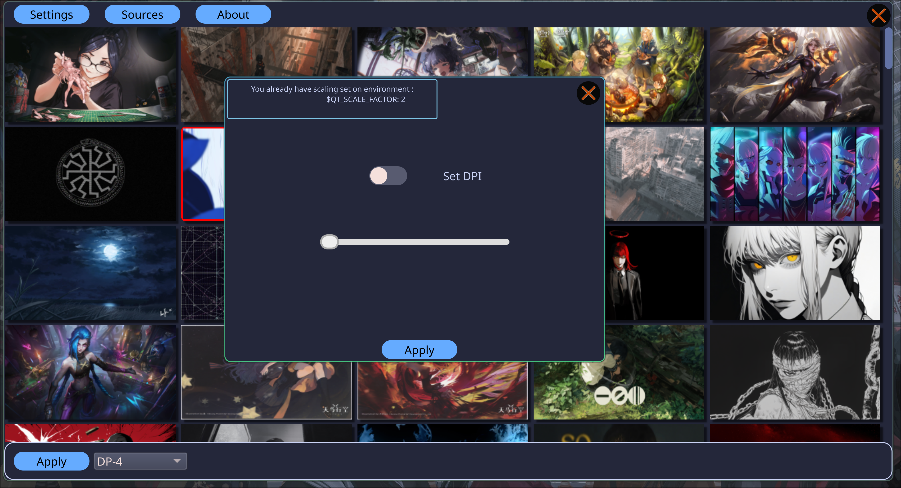

# Agemo is a Gui front end for Hyprpaper




## Requirements

- Hyprpaper
- Hyprland
- UV

# Important for first run ⚠️

- select source button and restart the application
- now wait , is doing work <br>
  if you have over 800 images in that directory it will take some time for the program to index them
  it will create this file when is done : ~.local/share/agemo/thumbnail_cache.json

## Install

clone the repo and run the script don’t need sudo

```
./install.sh
```

To remove <br>

```
./uninstall.sh
```

## Future updates

- sorting images by date
- recursive indexing of directories

<br>
<br>

### Donate

<a href="https://www.buymeacoffee.com/acidburn" target="_blank"></a>

## Monero 

43Sxiso2FHsYhP7HTqZgsXa3m3uHtxHQdMeHxECqRefyazZfpGVCLVsf1gU68jxJBo1G171AC181q1BqAUaG1m554MLsspG

## Bitcon 

bc1qk06cyheffclx7x434zpxjzcdl50452r9ducw0x
