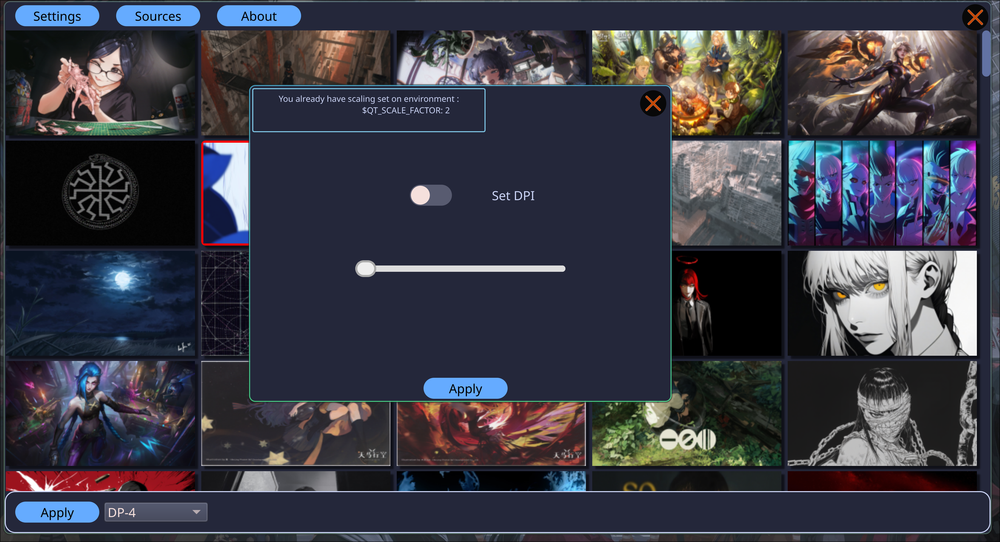

# Agemo is a Gui front end for Hyprpaper

- Support for high DPI displays
- Wayland native
- Built on Qt6
- Loads thousands of images without freezing
- Clean integration with Hyprpaper , no extra daemon needed




## Requirements

- Hyprpaper >= 0.8.0
- Hyprland >= 0.53.0
- UV
- gdk-pixbuf-thumbnailer or glycin-thumbnailer

## ☕ Hyprpaper v0.8 ready

Hyprpaper 0.8.0 introduced breaking changes use an older version from releases if you can't update

## Install

(recommended method) <br>
clone the repo and run the script don’t need sudo

```
./install.sh
```

<br>

```
./uninstall.sh
```

## Future updates

- sorting images by name
- recursive indexing of directories
- auto updater

<br>
<br>

### Donate

<a href="https://www.buymeacoffee.com/acidburn" target="_blank"></a>

## Monero 

43Sxiso2FHsYhP7HTqZgsXa3m3uHtxHQdMeHxECqRefyazZfpGVCLVsf1gU68jxJBo1G171AC181q1BqAUaG1m554MLsspG

## Bitcon 

bc1qk06cyheffclx7x434zpxjzcdl50452r9ducw0x
